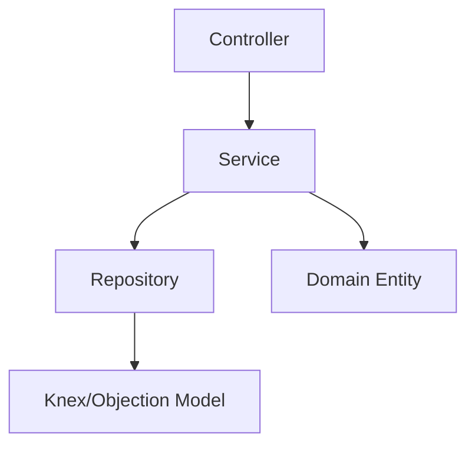

# Guia de Arquitetura e Decisões Técnicas

Este documento detalha as escolhas de design e padrões arquiteturais adotados no desenvolvimento da API do Desafio Técnico. O objetivo principal foi criar um sistema **escalável**, **testável** e **fácil de manter**.

---

## 🏗️ Padrões Arquiteturais

### 1. Arquitetura Modular (Clean Architecture)

A aplicação está organizada em módulos de domínio (`User`, `Product`, `Order`), seguindo uma adaptação da _Clean Architecture_. Cada módulo isola suas responsabilidades em camadas bem definidas:

- **Entity (Domínio)**: Contém a definição do objeto de negócio e regras intrínsecas. Exemplo: `User.entity.ts`. As entidades são responsáveis por garantir que o objeto esteja em um estado válido antes de ser persistido.
- **Repository (Infraestrutura)**: Isola o ORM (`Objection.js`) do restante do sistema. O `Service` nunca fala diretamente com o banco; ele solicita ao `Repository` que realize a persistência ou busca. Isso facilita a criação de mocks para testes unitários.
- **Service (Aplicação)**: Orquestra a lógica de negócio de alto nível. Coordena múltiplos repositórios e serviços para realizar uma tarefa (ex: criar um pedido, validar estoque e descontar do usuário).
- **Controller (Interface)**: Ponto de entrada via HTTP. Responsável por receber requisições, delegar ao serviço e formatar a resposta.

### 2. Persistência e Identificadores

#### UUID v7 (Time-ordered)

Diferente do UUID v4 tradicional, que é aleatório e pode causar fragmentação de índices em bancos de dados relacionais, optamos pelo **UUID v7**.

- **Vantagem**: Ele é ordenado temporalmente. Isso significa que novos registros são inseridos ao final das páginas de índice do PostgreSQL, melhorando drasticamente a performance de escrita e indexação.
- **Implementação**: Gerado diretamente no construtor das entidades (`uuidv7()`).

#### NanoID para Identificadores Amigáveis

Para o código do pedido (ex: `PED-X8K2`), utilizamos o `nanoid`. Ele gera strings curtas, de fácil leitura e com baixíssima probabilidade de colisão, ideal para comunicação com o usuário final.

---

## 🛡️ Integridade e Segurança

### 1. Validação com Zod

Utilizamos o **Zod** para declarar esquemas de dados. Ao contrário do `class-validator`, o Zod oferece:

- Validação síncrona/assíncrona robusta.
- Tipagem TypeScript derivada automaticamente dos esquemas (SSR - Single Source of Truth).
- Um `ZodValidationPipe` global garante que nenhum dado inválido entre na camada de serviço.

### 2. Mecanismo de Diffing (ObjectChanges)

No `UserRepository`, implementamos uma lógica de **Diffing**. Durante um `UPDATE`, calculamos apenas o que foi alterado em relação à entidade original.

- **Por que?** Reduz o tráfego de dados para o banco e evita o risco de sobrescrever campos que não deveriam ser alterados naquela operação específica.

### 3. Autenticação Stateless (JWT)

O sistema utiliza **JWT (JSON Web Tokens)** para autenticação. Isso permite que a API seja _stateless_, facilitando a escalabilidade horizontal (não depende de sessões em memória no servidor).

---

## 📦 Integrações Externas

### API de Produtos

O módulo de produtos não possui tabela própria local; ele atua como um _Gateway_ para a API `dummyjson.com`. A arquitetura permite que, caso decidamos migrar para um estoque local, apenas o `ProductService` e seu respectivo repositório precisem ser alterados, mantendo o contrato com o frontend intacto.

---

## 📈 Considerações de Escalabilidade

- **Global Config**: Uso do `@nestjs/config` para gestão centralizada de variáveis de ambiente.
- **PostgreSQL**: Escolhido pela robustez e suporte avançado a tipos de dados e transações.
- **Docker Ready**: Ambiente totalmente containerizado, garantindo paridade entre desenvolvimento, teste e produção.
